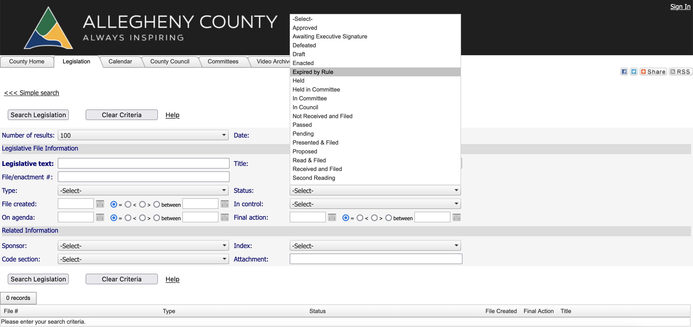

# BoardExplorerLegistar
BoardExplorerLegistar is a Python-based scraper that can be employed to extract data from local government Legistar pages.

## Getting Started

This short guide will inform you how to start using the BoardExplorerLegistar repository to obtain data from Legistar and upload that data to Google Docs.

### Part 1: Getting Data from Legistar

While this repository also allows the user to request data with the Legistar Web API, we will be focusing on data extraction through scraping, as this aspect is more unique to this repository.

1. Clone BoardExplorerLegistar onto your local machine and move noweba.py into your intended working directory. NoWebA.py contains all code related to scraping Legistar pages without the use of the Legistar Web API. It is worth noting that noweba.py requires BeautifulSoup 4, an HTML parsing library, to be installed.
    * To clone this repository, run `git clone https://github.com/LordOfBeans/BoardExplorerLegistar` in the terminal.
    * To Install BeautifulSoup, run `pip install bs4` in the terminal.

2. Create a new Python File in your working directory and type `import noweba` at the top of the file. This will allow you to use the functions and methods in noweba.py.

3. Requests in BoardExplorerLegistar are done primary through the use of dictionaries. The first step in making a request a creating a dictionary that could be representative of one request.
    There are 3 primary types of keys in noweba.py dictionaries:
    1. Text Contains Key  
        There are two keys in this category: Text and Title. The use of the Text key filters the legislation such that the provided String will be found in some form in the text of the legislation. Use of the title key will only check the title.
    2. Set Attribute Key  
        There are five keys in this category: Type, Status, Index, Controller, and Sponsor. For each of these keys, their value must match one of the values that can be seen in the advanced search view on a Legistar page. As you can see in the below image, there are many options for the Status key on Allegheny County's Legistar page.
        
    3. Date Key  
        The only key in this category is the 'Final Action Date' key. This key's value is itself another dictionary, containing optional Before and After keys, both taking datetime objects as values. The Before key filters all values to have had their final action before that data. The After key does the opposite. If both Before and After Keys are present, the results will be in between those two dates, with the Before key being the later date.
    Now that we know the types of keys, we will set up an example dictionary:

